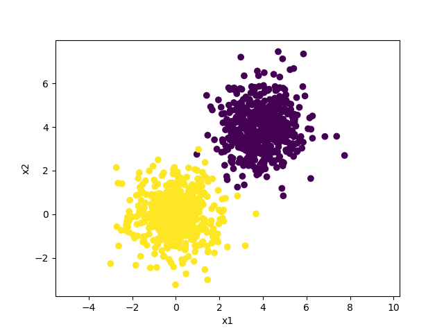
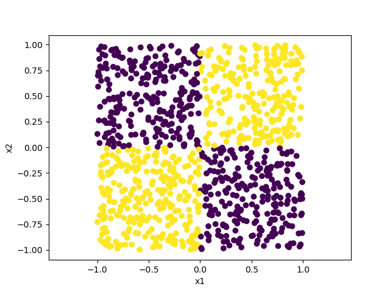
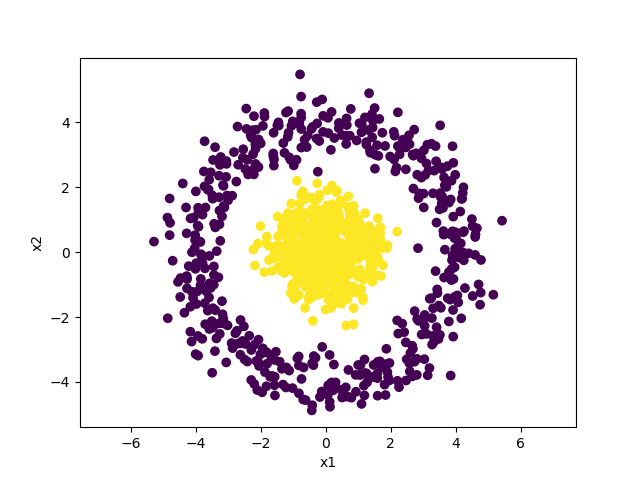
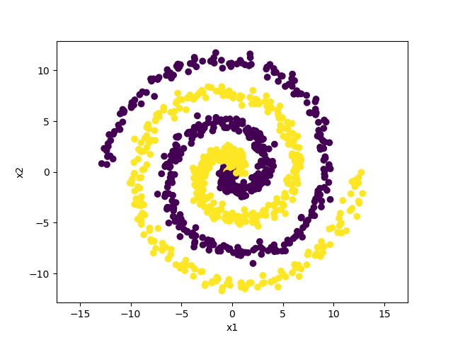
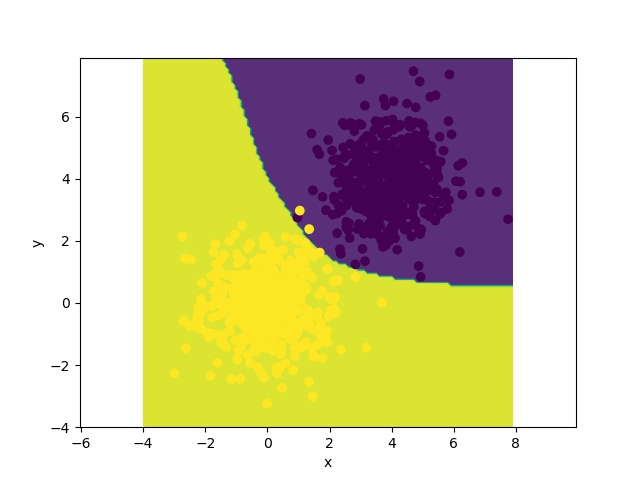
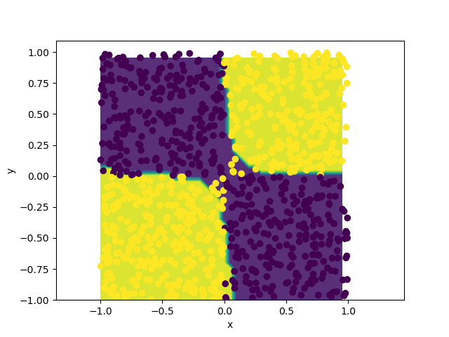
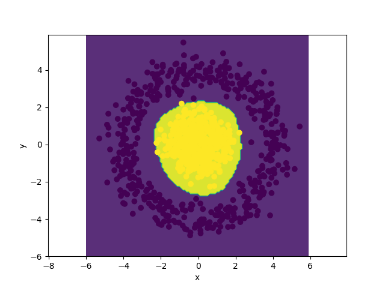
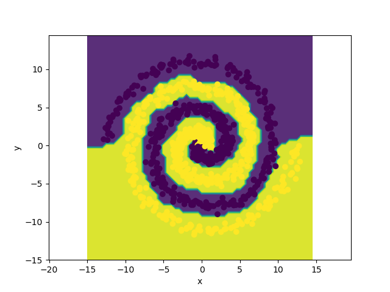

# Neural-Net-cpp

C++ 实现的人工神经网络，仅用于个人练习。

现有功能：

- 网络层 Layer
  - 全连接层 FullyConnectedLayer
  - 卷积层 ConvolutionalLayer (暂时只支持单通道输入输出)
  - 展平层 FlattenLayer
  - 激活层 ActivationLayer
  - 随机失活层 DropoutLayer
  
- 激活函数
  - Sigmoid
  - Tanh
  - ReLU

- 损失函数
  - 均方误差 MeanSquaredError

- 数据集
  - MNIST (手写体数据集)
  - 二维平面二分类
  - 多项式拟合


现有问题：

- 没有保存/读取模型功能，模型均是一次性的。
- 使用朴素梯度下降进行优化，非常不稳定，运行多次训练得到的结果可能天差地别。
- 没有 Softmax 功能，没有其他损失函数。
- batch_size 功能还没有实现，现在 batch_size 相当于为 1.

## 示例

### MNIST

**代码**

```cpp
Network network({
    new ConvolutionalLayer({28, 28}, {3, 3}),
    new ActivationLayer(new Sigmoid),
    new ConvolutionalLayer({26, 26}, {3, 3}),
    new ActivationLayer(new Sigmoid),
    new FlattenLayer,
    new FullyConnectedLayer(24 * 24, 100),
    new ActivationLayer(new Sigmoid),
    new FullyConnectedLayer(100, 10),
    new ActivationLayer(new Sigmoid)
});

auto [train_input, train_output] = load_testcase("../mnist_train.txt");
auto [test_input, test_output] = load_testcase("../mnist_test.txt");

network.train(train_input, train_output, new MeanSquaredError, 80, 0.1);
network.evaluate(test_input, test_output, new MeanSquaredError, true);
```

**训练输出**

```
[Load Dataset] 100.00%     6000/6000    
[Load Dataset] 100.00%     1000/1000    
[Train] 6000 train data
[Epoch  1/80]     6000/6000    loss: 0.092344669  (2994ms)
[Epoch 11/80]     6000/6000    loss: 0.090298650  (2969ms)
[Epoch 21/80]     6000/6000    loss: 0.090335344  (2876ms)
[Epoch 31/80]     6000/6000    loss: 0.031215471  (2525ms)
[Epoch 41/80]     6000/6000    loss: 0.017014869  (2448ms)
[Epoch 51/80]     6000/6000    loss: 0.013342757  (2454ms)
[Epoch 61/80]     6000/6000    loss: 0.011136877  (2538ms)
[Epoch 71/80]     6000/6000    loss: 0.009667794  (2508ms)
[Epoch 80/80]     6000/6000    loss: 0.008628765  (2468ms)
[Evaluate] 1000 evaluate data
    1000/1000    accuracy: 0.910000000
```

**重复 10 次训练**

```
#		loss			accuracy
-----------------------------------
1		0.012405698		0.870000000
2		0.012413764		0.902000000
3		0.005940926		0.926000000
4		0.008770140		0.912000000
5		0.010302665		0.902000000
6		0.022851723		0.838000000
7		0.047779869		0.623000000
8		0.011795792		0.874000000
9		0.013515847		0.887000000
10		0.010445787		0.907000000
-----------------------------------
avg		0.015622221		0.864100000
```

### 二维二分类问题

**代码**

```cpp
Network network({
    new FullyConnectedLayer(2, 100),
    new ActivationLayer(new Tanh),
    new FullyConnectedLayer(100, 100),
    new ActivationLayer(new Tanh),
    new FullyConnectedLayer(100, 100),
    new ActivationLayer(new Tanh),
    new FullyConnectedLayer(100, 1),
    new ActivationLayer(new Tanh)
});

auto [train_input, train_output] = load_plane(2000, "whirlpool");
auto [test_input, test_output] = load_plane(500, "whirlpool");

network.train(train_input, train_output, new MeanSquaredError, 1000, 0.001);

save_plane_mesh_with_data("../test.txt", "../mesh.txt", test_input, test_output, network);

// 接下来再用 Python 运行 test/PlotPlaneMesh.py 来可视化分类边界
```

**分类边界**

| Cluster                                                      | Window                                                       | Circle                                                       | Whirlpool                                                    |
| ------------------------------------------------------------ | ------------------------------------------------------------ | ------------------------------------------------------------ | ------------------------------------------------------------ |
|  |  |  |  |
|  |  |  |  |

### 多项式拟合

**代码**

```cpp
Network network({
    new FullyConnectedLayer(1, 100),
    new ActivationLayer(new Sigmoid),
    new FullyConnectedLayer(100, 100),
    new ActivationLayer(new Sigmoid),
    new FullyConnectedLayer(100, 1),
});

auto poly = [](double x) { return 5 * pow(x, 3) + 2 * pow(x, 2) - 7 * x + 1; };
auto [train_input, train_output] = load_polynomial(1000, poly, -2, 2);
network.train(train_input, train_output, new MeanSquaredError, 100, 0.01);

for (int x = -2; x <= 2; x += 1) {
    Matrix input = make_matrix({{1.0 * x}});
    Matrix output = network.predict(input);
    double predict = output(0, 0);
    double actual = poly(x);
    std::cout << "x: "
              << std::fixed << std::setprecision(2) << std::setw(2) << std::right << x << " Predict: "
              << std::fixed << std::setprecision(2) << std::setw(7) << predict << " Actual: "
              << std::fixed << std::setprecision(2) << std::setw(7) << actual << " Error: "
              << std::fixed << std::setprecision(2) << std::setw(7) << predict - actual << std::endl;
}
```

**结果**

```
x: -2 Predict:  -16.85 Actual:  -17.00 Error:    0.15
x: -1 Predict:    5.01 Actual:    5.00 Error:    0.01
x:  0 Predict:    1.06 Actual:    1.00 Error:    0.06
x:  1 Predict:    1.01 Actual:    1.00 Error:    0.01
x:  2 Predict:   35.04 Actual:   35.00 Error:    0.04
```

